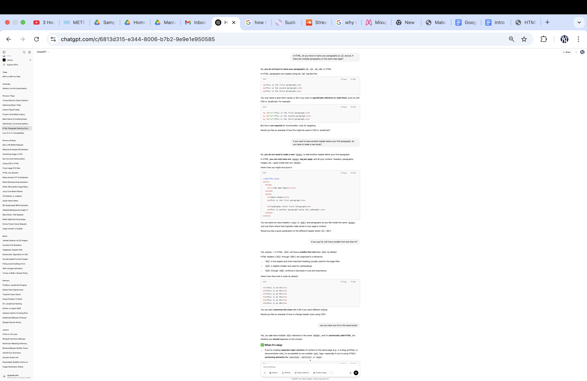

# Final
## Malcolm Longaker
### Intro To Programming
#### 05/08/2025
For my final project, I made an HTML Website on Github Pages with a "Listen," "About," "Home," "Photos," "Shows," and "Contact" page. Here is the link to my website: https://mlongaker.github.io/index.html 
I looked at the example website on github and saw the line of code `<meta charset="UTF-8">`. I researched what this meant and decided to include it in my project to make sure all of my text displays correctly.
I then added a title for my tab, and added a header that said “Malcolm Longaker” with a paragraph underneath saying “- drummer - producer -performer,” All split with line breaks.

I had some trouble with my homepage in multiple different areas. Firstly, I didn’t like how my images that I added were looking when I adjusted my window size, so I wanted to make it so that the images changed size but still fit into the window whatever size it was. I talked with chatgpt, here is my interaction asking about image size.

I did basically exactly the same thing that chat gpt first suggested in our interaction, except when I used the “div” to group a row of my images, I did not use the “space-between” command because my HTML in textmate was not recognizing it. I looked up the “space-between” command and it seemed to do a similar thing, it was recognized by my textmate, and when I loaded my website, it looked pretty much how I wanted it to so I kept it. Also under the “image-row” class I made with “div,” I was able to use “width” to make a gap between to of my images that was more aesthetically pleasing to me as well. This is the code for my image sizing and grouping:
Here is the CSS:
`.left-img {
	float: left;
	width: 48%;
	height: auto;
}
.right-img {
	float: right;
	width: 48%;
	height: auto;
}
.image-row {
	display: flex;
	gap: 30px;
	justify-content: space-around;`

Here is the HTML:
`

	
	

`

I also used the HTML Cheat Sheet as well as a few more small interactions with ChatGpt to type out another image link as well as doing some nav and tab titling for my website, all linked in my final code. Here are my other GPT interactions for my home page:

In my next session, I worked on my “about” page. Firstly, I drafted a description of myself and my current projects. After doing this, I added 2 h2s that both included 1 paragraph, one paragraph that is a bio, and one that is about my current projects. Below, I used the  command to display an image of myself by a waterfall. Some things that I used chat gpt to help me figure out was how to change how far below my text my image started using “space-above” in css, and whether to use the <b> command or <strong> to make my certain text, such as band and artist names, bold. I also used it to ask general formatting questions about if I have to name different paragraphs on the same webpage p1, p2, and p3 (no), and why CSS wasn’t working properly (I didn’t put a hyphen where one was needed)  Here is this interaction:

In my third work session, I linked audio files of my solo electronic project and my bands on the “Listen” Page of my website. I included all band titles and musical examples in the same body, and I was using div commands to organize the rows of music by what band they were in. ChatGPT helped me because my band titles were displaying with the music below with play controls, but my second title was aligning right, and my first title was aligning left. ChatGPT explained to me that I needed to use another 
 command to group the whole body together so that it knew to proportion them as one body according to css settings that I wrote. It also told me that I should leave my header 2s outside of the smaller 
 groupings. However, When I did not like the way that the songs were looking as evenly spaced rows, and I wanted to switch to each band being its own column that was horizontally next to the columns for the other bands, ChatGPT told me to now include the h2s in my 
 groupings, and take my smaller 
 groupings  and make the flex direction “column “with this CSS code
`.column {
	display: flex;
	flex-direction: column;
	gap: 1rem;
	width: 48%;
}`

This worked great, except for the fact that it made 1 large column, with each band name header/musical examples below the header being above and below each other instead of right to left of each other. I couldn’t figure out how to troubleshoot this and I ended up keeping it because it still looked significantly more aesthetically pleasing than when each band’s examples had their own evenly spaced row. These are my ChatGPT interactions for this session:

Lastly, I completed a photos page, contact page, and a shows page for my upcoming gig. For the photos page, I used techniques that I had already learned while making my other section to use the div commands to make three separate groupings of the five images I was using for that page, One for the first two tall images, a second one for the second to tall images, and a third for the fifth wide image. For all three groups, I used a CSS class that I had created earlier called “image-row” to make it so that there was a gap between the images that were grouped together for each two image group, and to make sure that images would change size if the window was resized by using flex display. For my contact page, it was very straight forward. I used a h1 for the title of the page and then h2 headers for my phone, email, and hyperlinks to my soundcloud and instagram that I figured out how to include by using the html cheat-sheet. Lastly, for my shows page, I used a similar strategy of using h2 headers for each show I have, and for one show that had a ticket link, I included a hyperlink. I also added a fire image for that page and styled it a bit in CSS. Here is my CSS code for that image:
`.fire-music-image {
	display: flex;
	margin: 0 auto;
	width: 75%;
	height: auto;
	bottom: 0;
}`
After I finished these pages, I realized that some of my images weren’t displaying online. To fix this I made sure that all of my images had the same exact file type typed out as they did when they were referenced in the html. I found some jpeg images that said “.jpeg” within the html code but not actually in the original Image name. When I fixed that I had gone as far with the site as I had planned on for this project. The one thing I want to fix in the future is that on mobile devices my audio playheads overlap.
